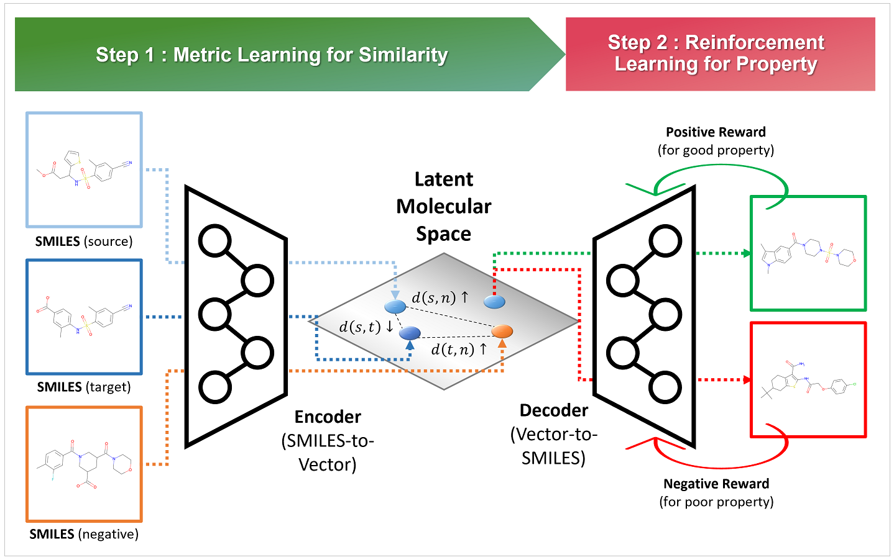

# MTMR: Molecule-to-Molecule Translation using Metric Learning and Reinforcement Learning



We propose MTMR, a molecular translation model based on metric learning and reinforcement learning, to achieve property improvement and high structural similarity performance at once.

MTMR can translate an existing drug into a novel drug candidate to empower desirable chemical properties without large changes of molecular structures.

MTMR requires molecule data represented by the format of simplified molecular-input line-entry system (SMILES) strings.

For more detail, please refer to Choi, Jonghwan, et al. "Collaboration of Metric Learning and Reinforcement Learning Enables Molecule-to-Molecule Translation for Drug Discovery" (under review)


* Latest update: 07 April 2022

--------------------------------------------------------------------------------------------
## SYSTEM REQUIERMENTS: 

- MTMR requires system memory larger than 8GB.

- (if GPU is available) MTMR requires GPU memory larger than 8GB.


--------------------------------------------------------------------------------------------
## Installation:

- We recommend to install via Anaconda (https://www.anaconda.com/)

- After installing Anaconda, please create a conda environment with the following commands:

```bash
git clone https://github.com/mathcom/MTMR.git
cd MTMR
conda env create -f environment.yml
```


--------------------------------------------------------------------------------------------
## Data:

- Before running tutorials, an user should unzip the files: DATA/drd2.zip and DATA/qed.zip

- The following commands are for unzip:

```bash
cd DATA
unzip drd2.zip
unzip qed.zip
cd ..
```

- Due to the large size of the sorafenib dataset, please contact me if you need the dataset.
  

--------------------------------------------------------------------------------------------
## Tutorials:

- We provide several jupyter-notebooks for tutorials.

- These tutorial files are available for reproducibility purposes.

- An user can open them using the following commands:

```bash
conda activate MTMR
jupyter notebook

~ run tutorial ~

conda deactivate
```


--------------------------------------------------------------------------------------------
## Contact:

- Email: mathcombio@yonsei.ac.kr


--------------------------------------------------------------------------------------------